# Gossamer
    

# UI
Built using the [Ember.js](http://emberjs.com/) framework that incorporates common idioms of app development. So we could focus on creating special features for this app rather than reinventing the wheel!  We also use [EmberCLI](https://ember-cli.com) to create consistent files, maintain a standard app structure, install and manage javascript library necessary for certain features and creating a production distribution of the app.  

Let us now get on to the application’s front-end structure and design. Below is a screenshot of one of the sections of the app.

## Top Navigation
Along with the app logo, this section displays notification counts, and a quick link for adding a /flowspec/ rule.

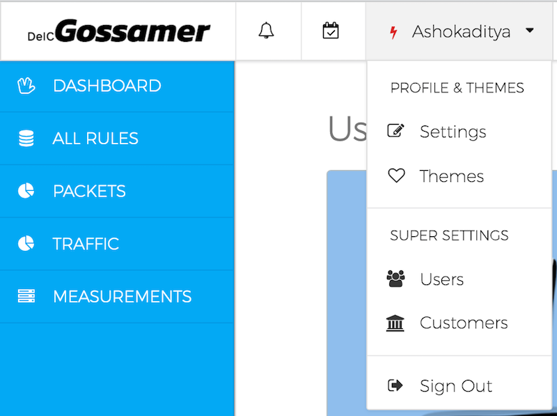

### Search
A site wide search bar that lets users to query rules by name, protocol, timestamp, etc.

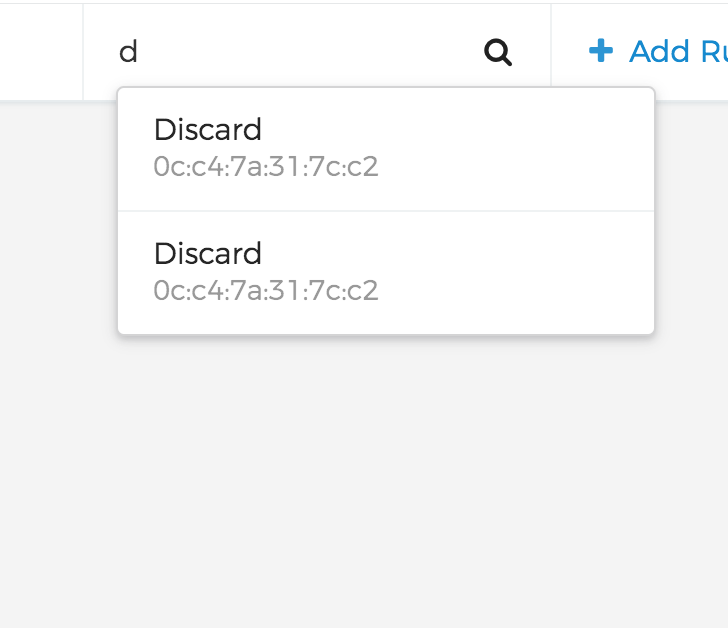

### Add Rule
This section allows a user to add a rule over the networks assigned to this specific user. A user can be assigned networks by a global admin or a db admin. A network admin is the lowest level of access. A db admin can only view and add rules over her own networks.

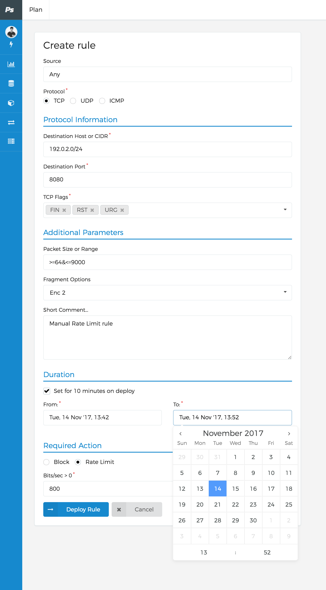

Each global admin can create customers and their networks. Each customer has a database admin that has access to all networks of her customer. A db admin in turn creates many network admins under her who have access over specific networks under a customer.

Thus in short if you are logged in the client app you can only pick and choose your own assigned networks to add rules on. Adding rules to unassigned networks is simply not possible.

There are also several small features included in the form to help create a rule in an efficient and easy way.
For example, a user cannot add a rule on a network that is not assigned to her; only relevant fields for each protocol are visible when creating a rule; default duration for a rule can be 10 minutes etc.

### Alerts
A user sees a blue dot over the *bell* icon on the main navigation if there have been anomalous activities or important updates since the last time the user logged out. This is displayed in a alerts menu from where the user can navigate to the  relevant section of the app to take necessary actions.

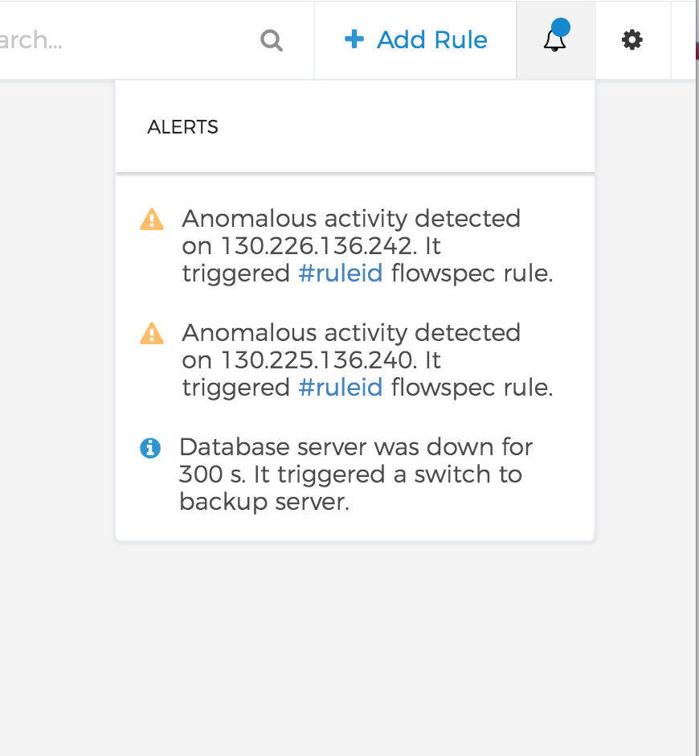

### Users (only for global admins)
This section displays info about all kinds of users in the database. Also, their access rights and what customer and networks each of the users have been assigned. 

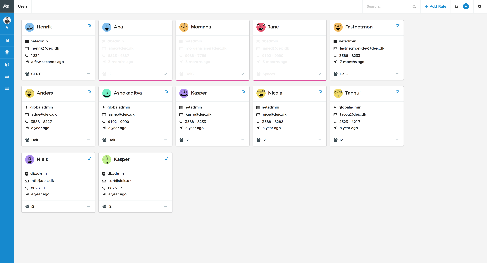

A global admin can edit a user’s access rights.  A db admin can only edit the user’s customer and networks a network admin is assigned with.

Here you can see a user is selected, marked by a blue bottom border. The edit form shows the name of the selected user, admin rights, customer and networks assigned to him. A db admin could change the assigned networks to this admin as seen in the screenshot below.

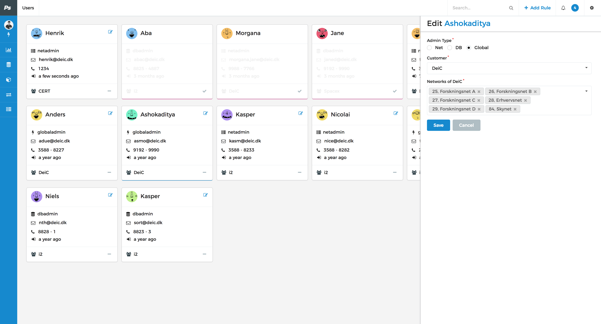

You could also activate and deactivate a user. A deactivated user can not be edited and the user details are faded out.

### Customers (only for db and global admins)
This section allows for creating new customers and their networks, as well as create new networks for an existing customer.

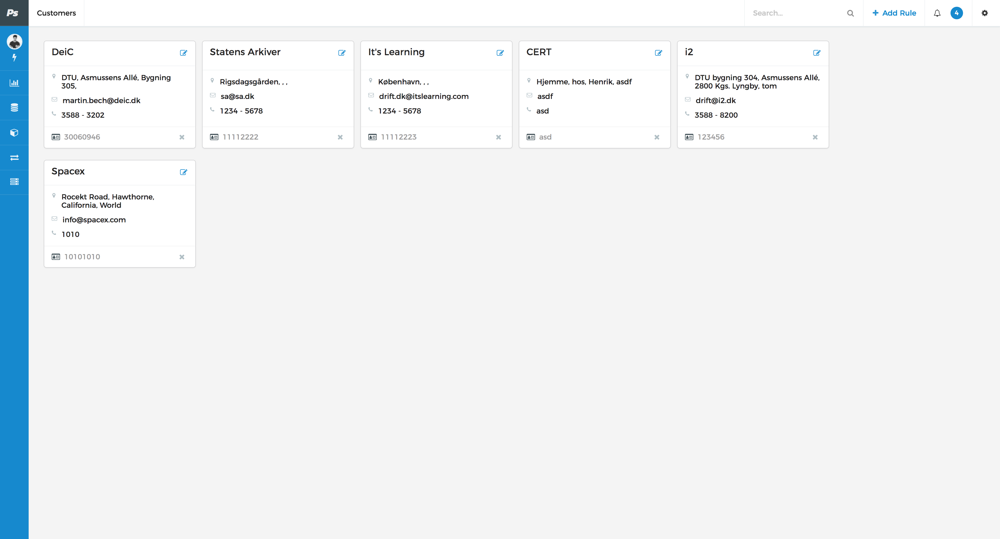

Here you can see a customer's editable fields.

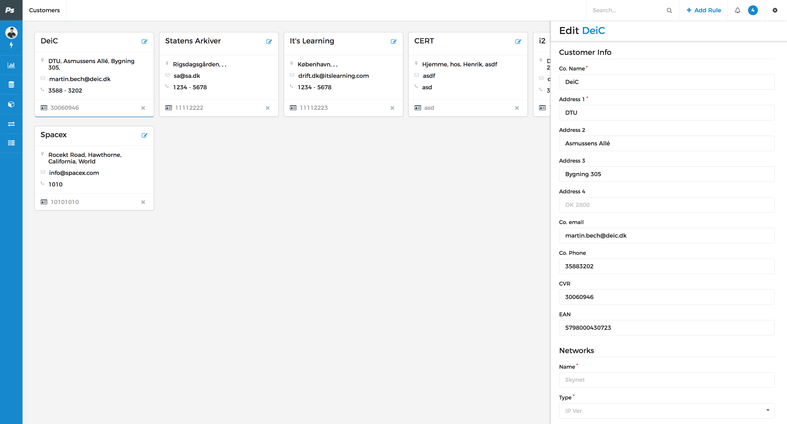

The screenshot below shows the added dummy network `Skynet` on a selected customer 'DeIC'. When a user clicks Save, all the other changes to the customer is saved to the server.

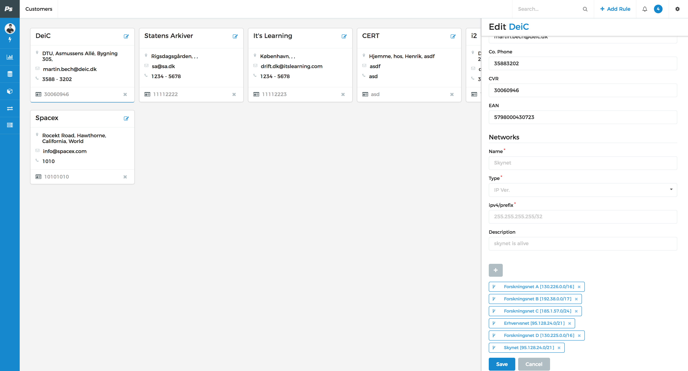

## Side Navigation
The logged-in user’s first name is displayed on a hover tooltip. An icon that denotes the user’s role or access rights is seen below the user's pic thumbnail.

The side nav links allow access to key views. It is responsive and can be used over a small screen equally well. The intuitive icons allow for least cognitive load. On mouseover you can also see what view the icons link to.

In the above screenshot, the user is a global admin and hence can see the top `users` sub menu.

### Dashboard
This section shows the most relevant network information as data-visuals. Metrics such as throughput, incoming and outgoing packets etc. that are essential for network analysis and mitigation of attacks are displayed here. Some data-visual are shown by default but a user can add or remove their own favorite data-visuals here so that they can get a quick overview of what is going on.

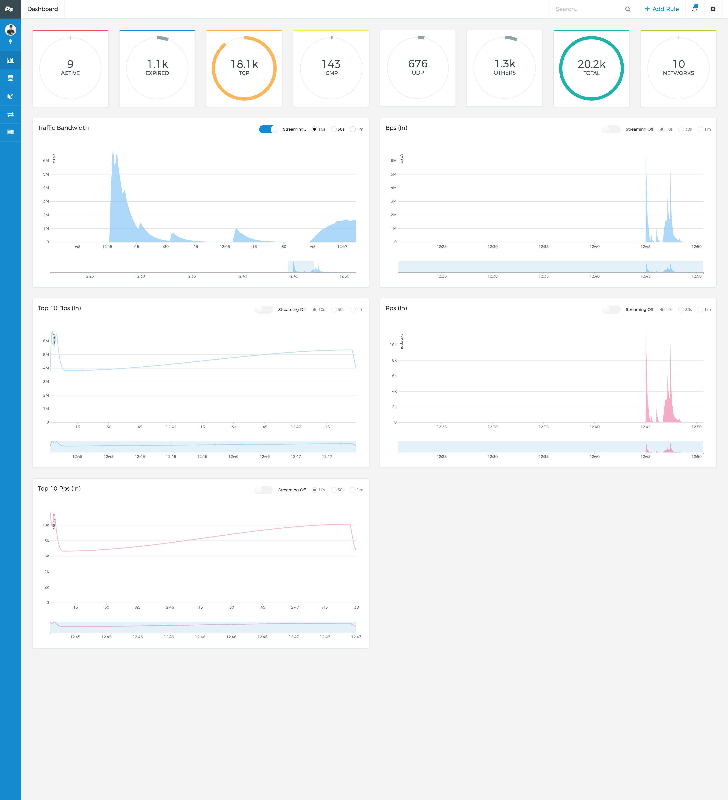

At the top you see widgets that show counts of most important information that the user wants to see.
A global user would see db wide stats like in this screenshot.

When the page loads, the *dataviz* widgets show the the latest snapshot from the `influxdb` server. You can then toggle the data to stream live on intervals of 10 seconds, 30 seconds and 1 minute for each *dataviz* widget.

Also, you can zoom and brush into a data-visual to inspect data points in finer detail. This is particularly helpful when you have a large volume of data spread over a small time range. You can see the top left *dataviz* widget is brushed to show more detail.

We are working on displaying a popup with details of the anomaly that created any specific data point on the graph. This popup will let the user navigate to the rule in the `Rules` section.

We are also working on a feature where a user can build her own data-visual and add it to her dashboard.

### Rules
This section displays all *flowspec* rules that exist in the rules database. 

The top section shows 10 most recently active rules that were created by the detection engine (we use *fastnetmon*) during a DDoS attack or an anomalous request; and each card corresponds to all attacks grouped by destination ip addresses, and a specific time range. 

Each of these rules are displayed as a *card*, with the range of affected ports displayed as a sticker counter on the top right section of the card. A rule *card* has the most relevant information that a user may need to see quickly, such as the attack protocol, port range on each destination IP that were attacked, the time the rule was enforced, how long it was active for, what action the rule performed in mitigating the anomalous behavior and its name. The card also shows the range of packet lengths and source and destination IP addresses. In case some of the values are empty or were not relevant for the rule creation it is replaced by en ellipsis.

There are key tooltips for understanding what a specific visual element represents throughout the application.

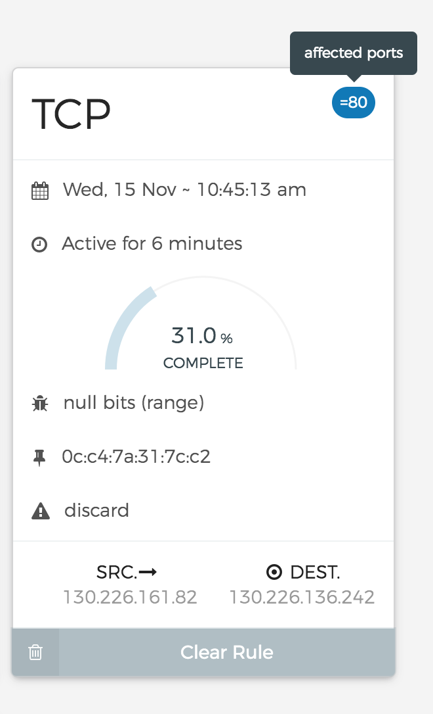

The duration the rule is also shown as a auto updating progress bar, that shifts color from grey to blue as the rule runs to completion. 

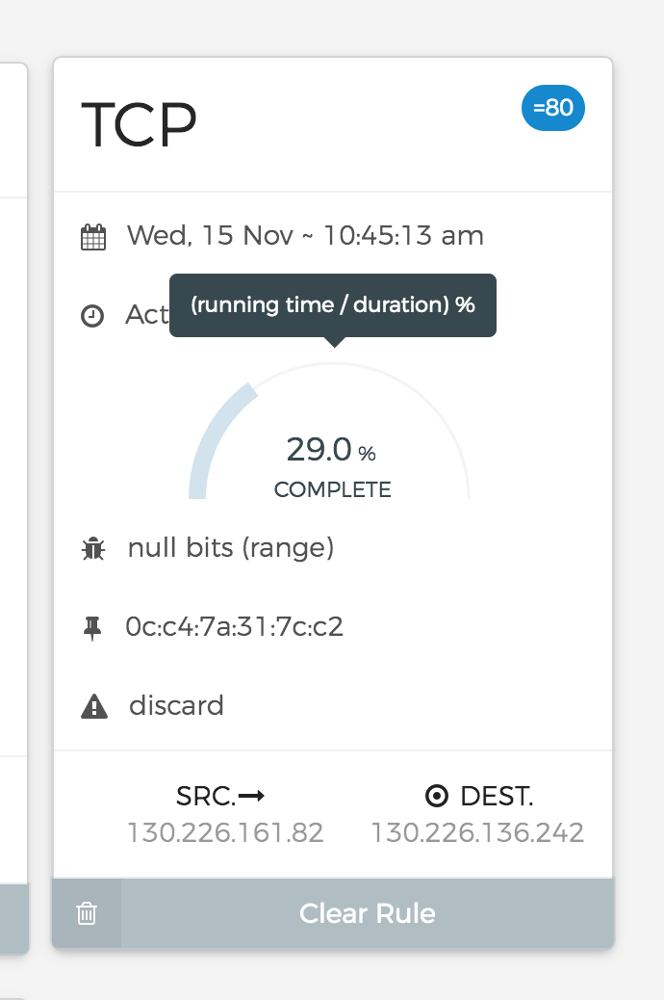

If a user has switches on to 'Refreshing...', then the completed rule cards disappear from the screen. The completed rules card stay on screen otherwise. 

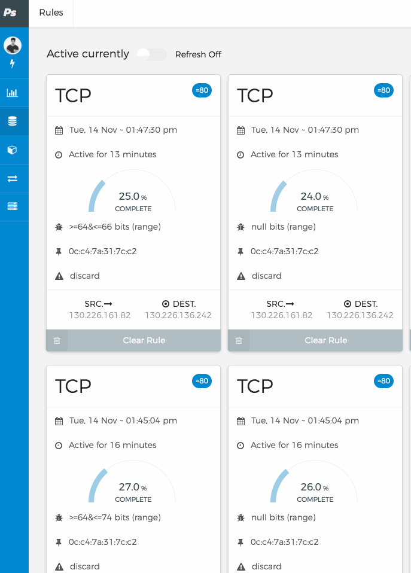

And here is a clip of completed rules being cleared from screen.

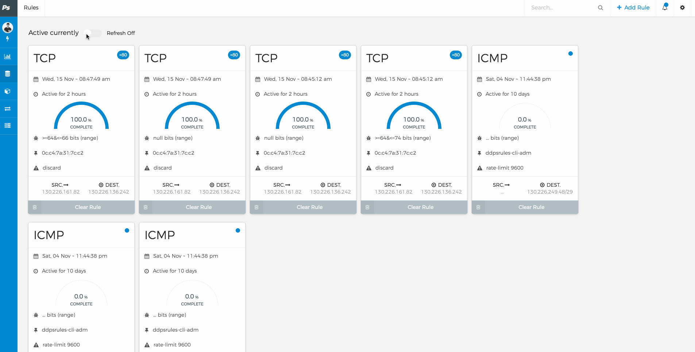

You can also clear an active rule using the `clear rule` button that is available to each active rule card.

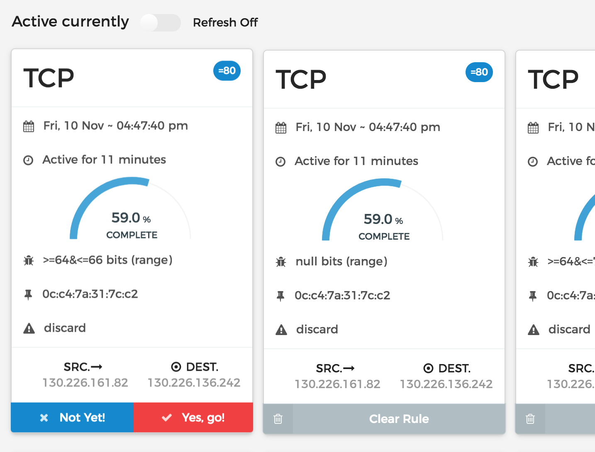

Here is a clear rule in action.

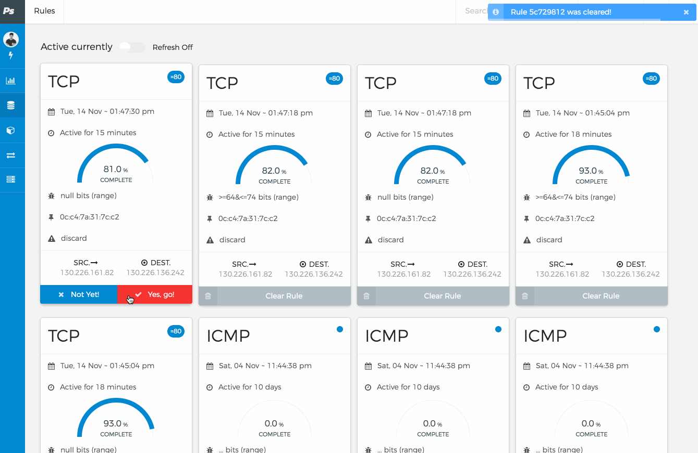

The second section shows earlier active attacks with a little less information than shown in a /card/ version of the the rule. The list items are responsive and render like a card on smaller screen sizes.

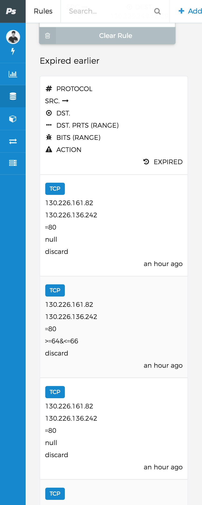

Since there are typically several thousand rules in the database, the archive view is lazy loaded and also allows for filtering of the list based on all the information seen on screen. One can filter the rules based on a date range, protocol, ip address, packet length range or number of affected ports. Or one could combine all the available filters to narrow the list even further.

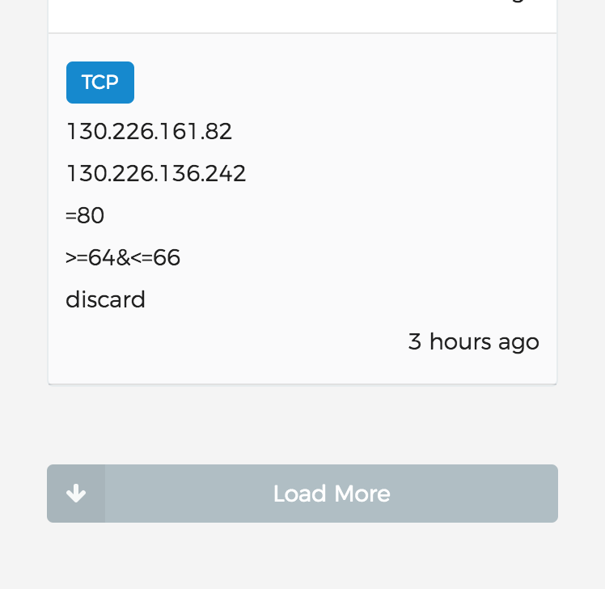

### Other Analytics
There are other relevant reports/data-visuals that can be quickly accessed using the side navigation. Such that the data presented in each report can be refined to a user’s interest and need.

For instance, a data-visual that shows the top ten IPs by incoming packets/sec over a 1-hour window could be modified to show incoming IPs over a single (multiple) specific IP(s) over a specific time range (day, week etc). One can add more measurements to such a data-visual such as protocol.

Each report will have several intuitive filters that allow for fine tuning the report as a user sees fit.

For example a view that lists all dataviz widgets related to packets.

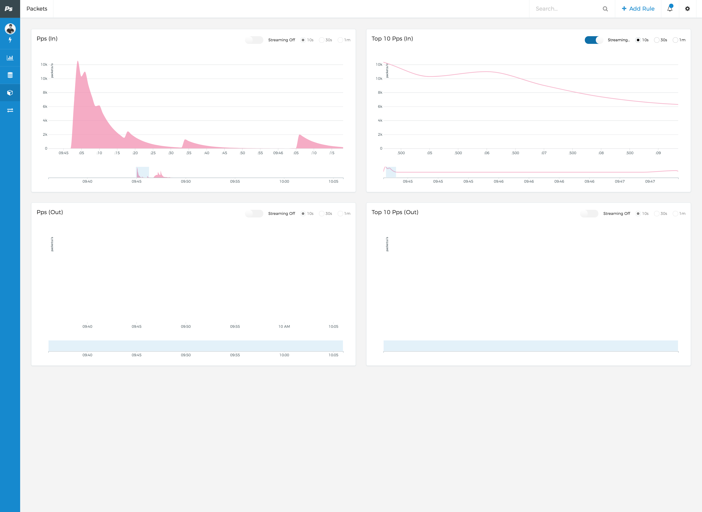

## Development Setup
This section details the necessary setup for contributing and developing the app on your local machine.

### Prerequisites
You will need the following things properly installed on your computer.

* [Git](https://git-scm.com/)
* [Node.js](https://nodejs.org/) (with NPM)
* [Bower](https://bower.io/)
* [Ember CLI](https://ember-cli.com/)
* [PhantomJS](http://phantomjs.org/)

### Installation
* `git clone <repository-url>` this repository
* `cd gossamer`
* `npm install`
* `bower install`
* `ember generate semantic-ui-ember`

### Semantic-UI
* `npm install -g gulp`
* Pull out a terminal window and goto the project directory and then do `cd /bower_components/semantic-ui`
* Run `npm install` and follow the default instructions to install
* `Yes, extend my current settings.`
* `Automatic (Use defaults locations and all components)`
* `Do not remove Setup Files`
* `Yes to building semantic now`
* This would create a `site` that you can then modify to reflect changes over elements of semantic-ui
* Make changes to `/globals/site.variables`, `/collections/menu.varibales`. To start, copy some of the variables and properties from `themes/default`
* Then run `gulp build` once done with changes.
* Or you can run `gulp watch` to watch changes and build the less files as you go.

### Running / Development
* `ember serve` or `ember s`
* Visit your app at [http://localhost:8686](http://localhost:8686).
* You could change the port in `.ember-cli` or have a more tailored `config/environment.js` file that allows for additional app settings.

## Code Generators
Make use of the many generators for code, try `ember h g` for more details

## Running Tests
* `ember test` or `npm test` or `ember t` for short
* `ember test --server` or `ember t --s` for short

## Building
* Clean the `tmp` and `dist` folders using `rm -r <foldername>/*`
* Build development `ember build -dev` (development)
* `ember build -prod` (production)
* `ember build -prod --output-path <path/to/build>` (to a specific folder other than `/dist`)

## Deploying
Ensure that all the tests pass before building a production version of the app. Also, ensure that a local .env file (not committed to git)
has all the relevant variables and their values stated correctly. They are different for test, staging and production apis (ddosapi).
Build and push the folders to the relevant remote nginx server using scp or git.

## Further Reading / Useful Links
* [ember.js](http://emberjs.com/)
* [ember-cli](https://ember-cli.com/)
* Development Browser Extensions
  * [ember inspector for chrome](https://chrome.google.com/webstore/detail/ember-inspector/bmdblncegkenkacieihfhpjfppoconhi)
  * [ember inspector for firefox](https://addons.mozilla.org/en-US/firefox/addon/ember-inspector/)
