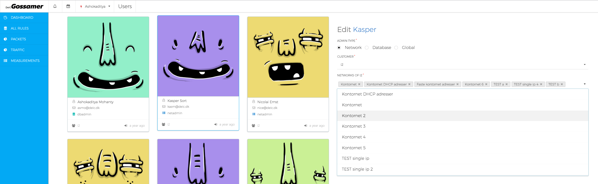
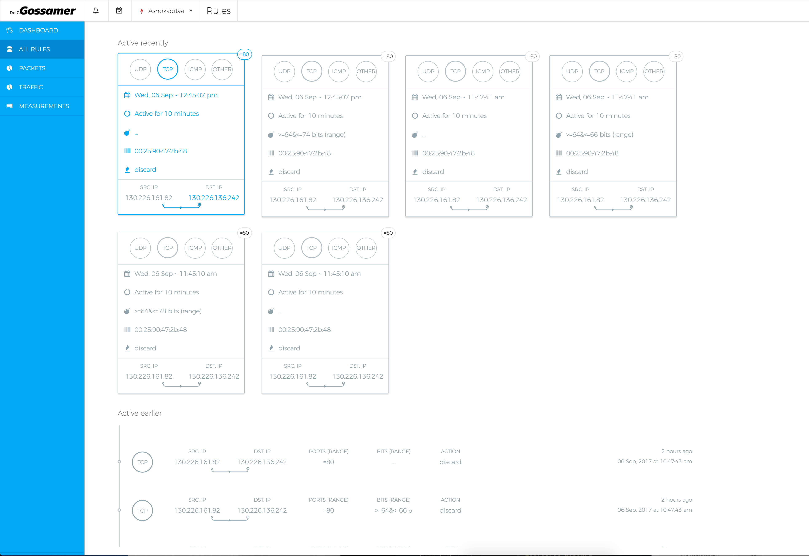
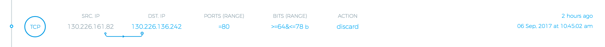

# Gossamer

# UI
Built using [Ember.js](http://emberjs.com/) framework that incorporates common idioms of app development so we could focus on creating special features for this app than reinventing the wheel.  Also, we use [EmberCLI](https://ember-cli.com) to create consistent files, maintain a standard app structure, install and manage javascript library necessary for certain features and finally creating a production distribution of the app. Ember CLI ensures that relevant source and test files are created void of bugs and unnecessary development errors.  

Let us now get on with the application’s front-end structure and design. Below is a screenshot of one of the sections of the app.

## Topbar
Along with the app logo, this section displays notification counts, and a quick link for adding a /flowspec/ rule, denoted with a calendar icon. The logged in user’s first name is displayed along with an icon that denotes the user’s role or access rights to the app and database.

In the above screenshot, the user is a global admin and hence can see the /super settings/ section. 

### Settings

Allows for configuring app settings such as notification timers, notification triggers etc.

Also allows a user to read through the application manual, FAQs and post queries that would be addressed by the development and support team to respond to.

### Themes

This section is intended for customising background colour of the sidebar, if a user prefers more or less contrast for better readability.

### Plan/Schedule Rules

This section allows a user to add a rule over the networks assigned to that user. A user can be assigned networks by a global admin or a db admin. A network admin is the lowest level of access that can only view and add rules over her own networks.

Basically each a global admin can create customers and their networks. Each customer has a database admin that has access over all networks of her customer. A db admin in turn creates many network admins under her who have access over specific networks under a customer.

Thus in short if you are logged in the client app you can only pick and choose your own assigned networks to add rules on. Adding rules to unassigned networks is simply not possible.

### Users (only for global admins)

This section displays info about all kinds of users in the database. Also, their access rights and what customer and networks each of the users have been assigned. 

A global admin can edit a user’s access rights.  A db admin can only edit the user’s customer and networks a network admin is assigned with.

Here you can see a user is selected, marked by a blue outline and vertical translation of the user card. The edit form shows the name of the selected user, admin rights, customer and networks assigned to him. A db admin could change the assigned networks to this admin as seen in the screenshot below.

### Customers (only for global admins)

This section allows for creating new customers and their networks, as well as create new networks for an existing customer.

## Sidebar
This allows the user to access key views quickly. It is responsive and can be used over a small screen equally well. The intuitive icons allow for least cognitive load so that the user can navigate intuitively.

The names of each item on the sidebar are descriptive in terms of what resource it shows and lets the user interact with. For example, analytics pages are denoted with a pie chart icon.

### Dashboard

This section shows the most relevant network information. Metrics such as bandwidth, incoming and outgoing packets etc. that are essential for network analysis and mitigation of attack are displayed here. Some charts are shown by default but a user can add or remove their own favourite charts here so that they can get a quick overview of what is going on.

We are working on adding time range and other relevant filters to each chart. Also when a user clicks on a data point then a popup must display the rules that were created because of the anomaly and clicking on that popup must navigate the user to the specific rule in the /all rules/ section.

We are going to add a feature where a user can build her own chart and add it to her dashboard. 

### All Rules

This section displays all *flowspec* rules that exist in the rules database. 

The top section shows 6 most recently active rules that were created by *fastnetmon* during a DDoS attack or an anomalous request; and each card corresponds to all attacks grouped by destination ip addresses, and a specific time range. 

Each of these rules are displayed as a /card/, with the range of affected ports displayed as a sticker counter on the top right section of the card. A rule /card/ has the most relevant information that a user may need to see quickly, such as the attack protocol, port range on each destination IP that were attacked, the time the rule was enforced, how long it was active for, what action the rule performed in mitigating the anomalous behaviour and its name. The card also shows the range of packet lengths and source and destination IP addresses. In case some of the values are empty or were not relevant for the rule creation it is replaced by en ellipsis. 

The second section shows earlier active attacks with a little lesser information than shown in a /card/ version of the the rule. Mouse over on the list item are indicated with subtle colour cues based on the severity of the attack that generated the rule. This is to help the user to take necessary steps according to priority of attack.

Since there are several thousand rules in the database, the archive view is lazy loaded and also allows for filtering of the list based on all the information points seen on screen. One can filter the rules based on a date range, protocol, ip address, packet length range or number of affected ports. Or one could combine all the available filters to narrow the list even further.

### Plan Rules

This section would allow adding *flowspec* rules to the PostgreSQL database. This is in case a user wants to create a rule that should trigger on a specific date and time. 

Since a rule when being added updated more than one table in the database, this action is restricted to the privilege of the user logged in.

### Charts

The idea is to create several relevant reports/charts that can be quickly accessed using the main navigation. Such that the data presented in each report can be tweaked even more to a user’s interest and need.

For instance, a chart that shows the top ten IPs that report incoming packets/sec over a 1hr window could be modified to show incoming IPs over a single (multiple) specific IP(s) over a specific time range (day, week etc) . One can add more measurements into it such as protocol.

Each report will have several intuitive filters that allow for fine tuning the report as a user sees fit.

## Application Setup
### Prerequisites

You will need the following things properly installed on your computer.

* [Git](https://git-scm.com/)
* [Node.js](https://nodejs.org/) (with NPM)
* [Bower](https://bower.io/)
* [Ember CLI](https://ember-cli.com/)
* [PhantomJS](http://phantomjs.org/)

### Installation

* `git clone <repository-url>` this repository
* `cd gossamer`
* `npm install`
* `bower install`
* `ember install ember-moment`
* `ember install ember-cli-moment-shim` 
* `ember install semantic-ui-ember`
* `ember generate semantic-ui-ember`

### Semantic-UI
* `npm install -g gulp`
* pull out a terminal window and goto the project directory and then do `cd /bower_components/semantic-ui`
* run `npm install` and follow the default instrctions to install
* `Yes, extend my current settings.`
* `Automatic (Use defaults locations and all components)`
* `Do not remove Setup Files`
* `Yes to building semantic now`
* this would create a `site` that you can then modify to reflect changes over elements of semantic-ui
* make changes to `/globals/site.variables`, `/collections/menu.varibales`. To start, copy some of the variables and properties from `themes/default`
* then run `gulp build` once done with changes.
* or you can run `gulp watch` to watch changes and build the less files as you go.

### Running / Development

* `ember serve`
* Visit your app at [http://localhost:4200](http://localhost:8080).
* You could change the port in `.ember-cli`

## Code Generators

Make use of the many generators for code, try `ember help generate` for more details

## Running Tests

* `ember test`
* `ember test --server` or `ember t -s` for short

## Building

* `ember build` (development)
* `ember build --environment production` (production)

## Deploying

Specify what it takes to deploy your app.

## Further Reading / Useful Links

* [ember.js](http://emberjs.com/)
* [ember-cli](https://ember-cli.com/)
* Development Browser Extensions
  * [ember inspector for chrome](https://chrome.google.com/webstore/detail/ember-inspector/bmdblncegkenkacieihfhpjfppoconhi)
  * [ember inspector for firefox](https://addons.mozilla.org/en-US/firefox/addon/ember-inspector/)